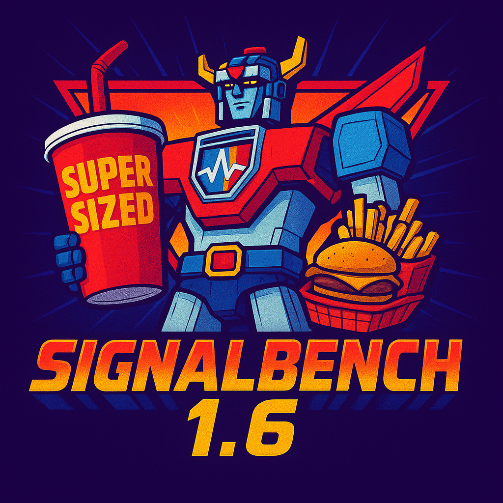

<div align="center">
  
</div>

# SignalBench

Endpoint Telemetry Generator from GoCortex.io

A Rust-based application for Linux that generates endpoint telemetry aligned with MITRE ATT&CK techniques for security analytics, research, and training environments.

## Overview

SignalBench enables security professionals to generate realistic endpoint telemetry patterns for analytics development, research, and training scenarios. It implements multiple techniques from the MITRE ATT&CK framework across categories including persistence, privilege escalation, defence evasion, credential access, discovery, lateral movement, collection, impact, command and control, and exfiltration.

### Important: Telemetry Generation Design

SignalBench executes actual OS commands that emulate technique-aligned activity patterns whilst remaining safe and non-destructive. This design generates realistic telemetry for security analytics:

- Activities perform real actions (network operations, file manipulation, process injection, etc.)
- Each technique executes commands that generate observable endpoint signals
- Activities are designed to be controlled and limited to avoid actual compromise
- Cleanup procedures ensure no lasting system changes remain

### Simulation-Aware Environment Notice

Many modern security products are simulation-aware and may not generate alerts for research tools by design. This tool is intended for controlled lab environments, analytics development, and training scenarios.

## Voltron Mode - Multi-Host Attack Simulation

NEW in v1.6.19: SignalBench introduces Voltron Mode, enabling distributed MITRE ATT&CK technique execution across multiple Linux endpoints through encrypted peer-to-peer coordination.

### What is Voltron Mode?

Voltron Mode transforms SignalBench from a single-host telemetry generator into a multi-host attack simulation platform. Techniques requiring lateral movement, network-based command and control, or distributed operations can now execute across actual networked systems, generating authentic cross-host telemetry.

### Architecture

- Server: Coordinator running on TCP 0.0.0.0:16969 with encrypted JSON-RPC 2.0 protocol
- Clients: Endpoint nodes executing techniques on command
- Encryption: Pre-shared key (PSK) authentication with ChaCha20-Poly1305 for all communication
- Journal: SQLite database tracking execution state for crash recovery
- Dual-Plane: Control channel (TCP 16969) plus native protocol ports (SSH 2222, VNC 5900, etc.)

### Current Capabilities

T1021.004-PROTO - SSH Lateral Movement
- Real SSH connections between endpoints on port 2222 (avoiding system SSH)
- Actual authentication, key exchange, tunnel establishment
- Generates authentic SSH protocol telemetry

T1021.005-PROTO - VNC Remote Desktop
- Full RFB (Remote Framebuffer) protocol implementation
- TightVNC file transfer extension (messages 132-133)
- Simulates data exfiltration: uploads gocortex.sh (8KB) and ssigre-malware.bin (24KB)
- Generates authentic VNC protocol and file transfer telemetry

### Getting Started with Voltron Mode

1. Generate Pre-Shared Key
```bash
# On server host
signalbench voltron keygen --output voltron.key

# Copy voltron.key to all client hosts
scp voltron.key user@client1:/path/to/voltron.key
scp voltron.key user@client2:/path/to/voltron.key
```

2. Start Server
```bash
# On server host
signalbench voltron server

# Server listens on 0.0.0.0:16969
# Displays fingerprint for verification
# Monitors client connections and technique execution
```

3. Connect Clients
```bash
# On each client host
signalbench voltron client --server 192.168.1.10:16969

# Clients register with server
# Send heartbeat every 30 seconds
# Execute techniques on demand
```

4. Check Formation Status
```bash
# From any host with network access to server
signalbench voltron formed --server 192.168.1.10:16969

# Displays connected clients, versions, status, last seen times
```

5. Execute Distributed Techniques
```bash
# SSH lateral movement (attacker -> victim)
signalbench voltron run --server 192.168.1.10 --technique T1021.004-PROTO --attacker client1 --victim client2

# VNC remote desktop with file transfer
signalbench voltron run --server 192.168.1.10 --technique T1021.005-PROTO --attacker client1 --victim client2
```

6. List Voltron-Compatible Techniques
```bash
# Show all techniques including Voltron-specific implementations
signalbench voltron list
```

### Security Considerations

- Controlled Environments Only: Voltron Mode is designed for isolated lab environments
- Pre-Shared Keys: All communication requires PSK authentication
- Encryption: ChaCha20-Poly1305 AEAD encryption for all peer communication
- No Internet: Techniques communicate only between registered peers
- Reversibility: All distributed techniques maintain 100% cleanup capability

## Features

### Telemetry Coverage

42 Total Techniques with 40 Supersized Implementations (95% coverage) across:

- Discovery: System/network reconnaissance, security tool detection, user/group enumeration
- Credential Access: Memory dumping, keylogging, credential file harvesting, password hash extraction
- Privilege Escalation: SUID binaries, sudo manipulation, local account creation
- Defence Evasion: PATH hijacking, audit log manipulation, command history clearing, process masquerading, web shells
- Execution: Reverse shells, Python reconnaissance, command injection, script execution
- Command and Control: Port knocking, DNS tunnelling, ICMP beaconing, tool transfer
- Exfiltration: Network protocols, DNS tunnelling, ICMP data transfer
- Lateral Movement: SSH connections, protocol-based movement (Voltron Mode)
- Persistence: Cron jobs, startup scripts, systemd services, SSH keys
- Collection: Automated file collection, recursive directory enumeration
- Impact: Resource hijacking, file deletion, anti-forensics

### Capabilities

- Command-line interface for Linux environments
- Multi-category execution support for running multiple technique categories simultaneously
- Universal Linux compatibility with static musl builds
- Configurable activity parameters via JSON configuration
- Safe execution environment with controlled parameters
- Comprehensive logging of all activities
- Dry-run mode to preview actions without executing
- Automatic cleanup functionality to remove all artefacts
- `--no-cleanup` flag to preserve artefacts for debugging and analysis
- Support for selecting techniques by exact name when multiple techniques share the same MITRE ATT&CK ID
- Comprehensive documentation of all implemented techniques
- Voltron Mode for multi-host distributed attack simulation

## Installation

### Option 1: Download Pre-built Binary (Recommended)

SignalBench provides pre-built binaries for maximum compatibility across Linux distributions.

For Universal Linux Compatibility (Recommended):
```bash
# Download static binary that works on any Linux distribution
wget https://github.com/gocortex/signalbench/releases/download/v1.6.19/signalbench-1.6.19-linux-musl-x86_64
chmod +x signalbench-1.6.19-linux-musl-x86_64
sudo mv signalbench-1.6.19-linux-musl-x86_64 /usr/local/bin/signalbench

# For ARM64 systems (Apple Silicon, ARM servers)
wget https://github.com/gocortex/signalbench/releases/download/v1.6.19/signalbench-1.6.19-linux-musl-aarch64
chmod +x signalbench-1.6.19-linux-musl-aarch64
sudo mv signalbench-1.6.19-linux-musl-aarch64 /usr/local/bin/signalbench
```

### Option 2: Build from Source

1. Ensure you have Rust and Cargo installed
2. Clone this repository
3. Build the application:

```bash
cargo build --release
```

## Usage

### Single-Host Mode

```bash
# List all available techniques
signalbench list

# Generate telemetry for a specific technique
signalbench run <technique_id_or_name> [--dry-run] [--no-cleanup]

# Generate telemetry for all techniques in a category
signalbench category <category> [--dry-run] [--no-cleanup]

# Generate telemetry for multiple categories simultaneously
signalbench category <category1> <category2> <category3> [--dry-run] [--no-cleanup]

# Run with custom configuration
signalbench run <technique_id_or_name> --config <config_file.json>

# Preserve artefacts for debugging (skip cleanup)
signalbench run <technique_id_or_name> --no-cleanup
```

### Multi-Host Mode (Voltron)

```bash
# Generate and distribute pre-shared key
signalbench voltron keygen --output voltron.key

# Start server
signalbench voltron server [--debug]

# Connect client
signalbench voltron client --server <server_ip>:16969 [--debug]

# Check formation status
signalbench voltron formed --server <server_ip>:16969

# List Voltron-compatible techniques
signalbench voltron list

# Execute distributed technique
signalbench voltron run --server <server_ip> --technique <technique_id> --attacker <client1> [--victim <client2>]
```

### Configuration Files

You can customise technique parameters using a JSON configuration file:

```bash
# Generate telemetry with custom parameters
signalbench run T1003.001 --config docs/config-example.json

# Generate telemetry for all techniques in a category with custom parameters
signalbench category credential_access --config docs/config-example.json

# Generate telemetry for multiple categories with custom parameters
signalbench category discovery execution credential_access --config docs/config-example.json
```

A sample configuration file is provided at [docs/config-example.json](docs/config-example.json).

### Multi-Category Execution

SignalBench supports running multiple technique categories simultaneously for comprehensive analytics scenarios:

```bash
# Discovery and execution techniques together
signalbench category discovery execution --dry-run

# Privilege escalation and credential access techniques
signalbench category privilege_escalation credential_access

# Comprehensive telemetry across multiple categories
signalbench category discovery execution credential_access command_and_control exfiltration
```

For detailed information on available techniques and implementations, refer to the comprehensive [Technical Documentation](docs/TECHNIQUES.md).

## Contact & Support

For documentation, updates, and support, visit [GoCortex.io](https://gocortex.io).

Developed by Simon Sigre at GoCortex.io.
